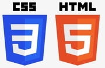
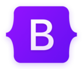

# Mi Primera Web Personal :rocket:

Esta es mi primera web personal realizada para el curso full stack developer de [GeeksHubsAcademy](https://geekshubsacademy.com/).

Para  su realización he empleado los conocimientos adquiridos en :

 

Para el diseño responsive de mi web he utilizado una combinación de técnicas. Por un lado el diseño fluido introduciendo anchos en unidades relativas para adaptarla a varios anchos de pantalla. Y por otro lado he introducido dos puntos de interrupción para ajustar la web a dispositivos móviles.

Aquí tenéis el resultado de este proyecto. Espero que os guste!

[Mi página personal](https://joanbatiste.github.io/PaginaPersonal/)